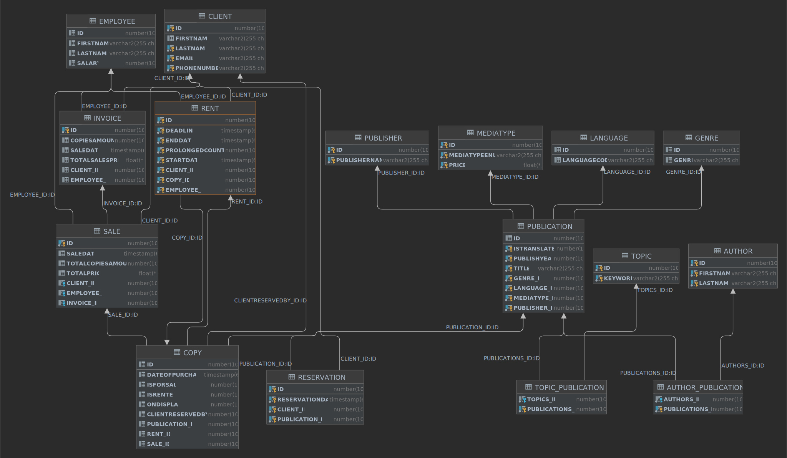

# JPALibraryManager
A simple Quarkus JPA exercise for a library management system.

## ERD

[Old ERD](https://user-images.githubusercontent.com/55828102/158328170-28eb11c1-d288-4feb-a973-01d9bc313120.png)

## Information

* [Requirements](docs/Anforderungen.pdf)
* [Phases Tasks](docs/Phasen_Aufgaben.pdf)
* [Project plan](docs/Projektplan.pdf)
* [General conditions](docs/Rahmenbedinungen.pdf)
* [First Chapter End PP](docs/First_Chapter_End_Presentation.pptx)

