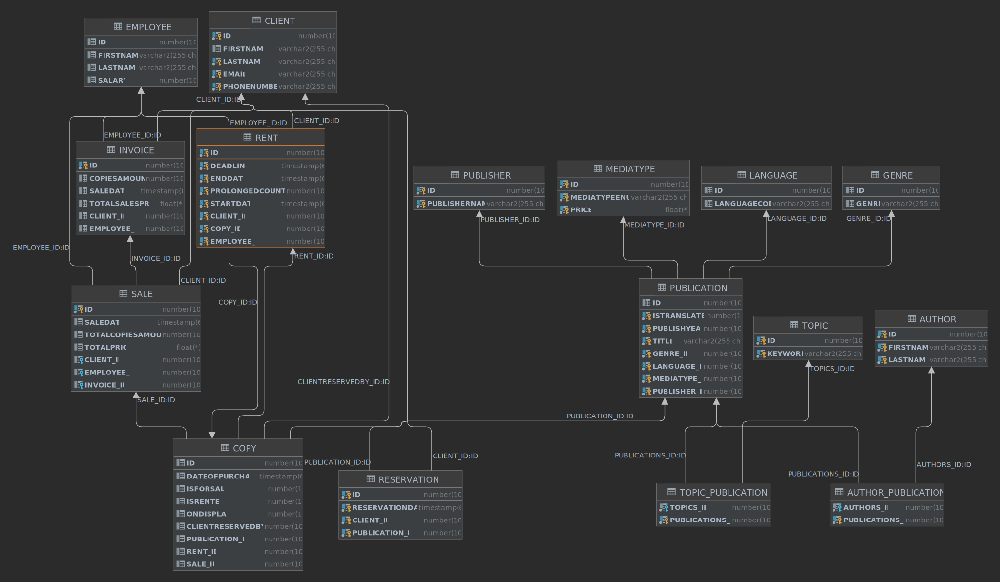

# JPALibraryManager
A simple Quarkus JPA exercise for a library management system.

### ERD

[old ERD](https://user-images.githubusercontent.com/55828102/158328170-28eb11c1-d288-4feb-a973-01d9bc313120.png)

## Information

* [Requirements](Anforderungen.pdf)
* [Phases Tasks](Phasen_Aufgaben.pdf)
* [Project plan](Projektplan.pdf)
* [General conditions](Rahmenbedinungen.pdf)

